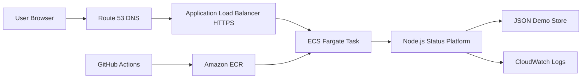

# Cloud-Native Incident Status & Auto-Recovery Platform

SignalOps Status is a dark, modern incident-status platform that monitors service health, opens incidents automatically, triggers a recovery runbook, and resolves incidents when the service comes back.

This is designed as a fresher-friendly DevOps portfolio project: it is useful, working, cloud-native, and explainable without needing a very complex Kubernetes setup.

## Features

- Service health checks with configurable timeout and failure threshold
- Automated incident creation when a service fails repeatedly
- Auto-recovery hook with a built-in demo recovery action
- Incident timeline and automation event feed
- Dockerized app with health check
- GitHub Actions pipeline for validation, image push, and ECS redeploy
- Terraform infrastructure for AWS ECS Fargate, ECR, ALB, ACM, Route 53, and CloudWatch Logs
- Custom domain support, for example `status.yourdomain.com`

## Architecture



## Run Locally

```bash
npm run check
npm start
```

Open:

```text
http://localhost:8080
```

If port `8080` is already busy, run with another port:

```powershell
$env:PORT="18080"; npm start
```

Docker:

```bash
docker compose up --build
```

If your Docker installation uses the older command, run `docker-compose up --build`.

Demo flow:

1. Open the dashboard.
2. Click `Fail Demo` on `Checkout API`.
3. Wait for the health monitor or click `Run Check` twice.
4. Watch an incident open, auto-recovery start, and the service return to operational.

## Environment Variables

| Variable | Purpose | Default |
| --- | --- | --- |
| `PORT` | App port | `8080` |
| `DATA_DIR` | Persistent JSON store directory | `./data` |
| `CHECK_INTERVAL_MS` | Health check interval | `15000` |
| `RECOVERY_COOLDOWN_MS` | Minimum time between recovery actions | `60000` |
| `ALERT_WEBHOOK_URL` | Optional webhook for incident alerts | empty |
| `RECOVERY_WEBHOOK_URL` | Optional external recovery runbook endpoint | empty |

## Upload To GitHub

Create a new GitHub repository named `incident-status-platform`, then run:

```bash
git init
git add .
git commit -m "Initial incident status platform"
git branch -M main
git remote add origin https://github.com/YOUR_USERNAME/incident-status-platform.git
git push -u origin main
```

## Host On AWS With A Custom Domain

Recommended domain layout:

```text
status.yourdomain.com
```

Prerequisites:

- AWS CLI configured locally
- Docker installed and running
- Terraform installed
- A domain in Route 53, or a domain from another registrar whose nameservers point to a Route 53 hosted zone

### 1. Prepare Route 53

If your domain is already in Route 53, copy the hosted zone ID.

If your domain is from another provider:

1. Create a public hosted zone in Route 53 for `yourdomain.com`.
2. Copy the Route 53 nameservers.
3. Paste those nameservers into your domain registrar.
4. Wait for DNS propagation.

### 2. Configure Terraform Variables

```bash
cd infra/terraform
cp terraform.tfvars.example terraform.tfvars
```

Edit `terraform.tfvars`:

```hcl
aws_region     = "ap-south-1"
project_name   = "incident-status-platform"
domain_name    = "status.yourdomain.com"
hosted_zone_id = "YOUR_ROUTE53_HOSTED_ZONE_ID"
```

### 3. Create ECR First

The ECS service needs a Docker image before it can start, so create the ECR repository first:

```bash
terraform init
terraform apply -target=aws_ecr_repository.app
```

### 4. Push The First Docker Image

Replace the values with your account and region:

```bash
AWS_ACCOUNT_ID=123456789012
AWS_REGION=ap-south-1
ECR_REPOSITORY=incident-status-platform

aws ecr get-login-password --region $AWS_REGION | docker login --username AWS --password-stdin $AWS_ACCOUNT_ID.dkr.ecr.$AWS_REGION.amazonaws.com
docker build -t $ECR_REPOSITORY:latest ../..
docker tag $ECR_REPOSITORY:latest $AWS_ACCOUNT_ID.dkr.ecr.$AWS_REGION.amazonaws.com/$ECR_REPOSITORY:latest
docker push $AWS_ACCOUNT_ID.dkr.ecr.$AWS_REGION.amazonaws.com/$ECR_REPOSITORY:latest
```

### 5. Create The Full AWS Infrastructure

```bash
terraform apply
terraform output app_url
```

Terraform creates:

- ECR repository
- ECS cluster and Fargate service
- Application Load Balancer
- HTTPS listener
- ACM certificate with DNS validation
- Route 53 alias record
- CloudWatch log group

### 6. Connect GitHub Actions To AWS

Create a GitHub OIDC role in AWS IAM.

Trust policy, replace account, username, and repository:

```json
{
  "Version": "2012-10-17",
  "Statement": [
    {
      "Effect": "Allow",
      "Principal": {
        "Federated": "arn:aws:iam::123456789012:oidc-provider/token.actions.githubusercontent.com"
      },
      "Action": "sts:AssumeRoleWithWebIdentity",
      "Condition": {
        "StringEquals": {
          "token.actions.githubusercontent.com:aud": "sts.amazonaws.com",
          "token.actions.githubusercontent.com:sub": "repo:YOUR_USERNAME/incident-status-platform:ref:refs/heads/main"
        }
      }
    }
  ]
}
```

Minimal permissions for the role:

```json
{
  "Version": "2012-10-17",
  "Statement": [
    {
      "Effect": "Allow",
      "Action": "ecr:GetAuthorizationToken",
      "Resource": "*"
    },
    {
      "Effect": "Allow",
      "Action": [
        "ecr:BatchCheckLayerAvailability",
        "ecr:BatchGetImage",
        "ecr:CompleteLayerUpload",
        "ecr:InitiateLayerUpload",
        "ecr:PutImage",
        "ecr:UploadLayerPart"
      ],
      "Resource": "arn:aws:ecr:ap-south-1:123456789012:repository/incident-status-platform"
    },
    {
      "Effect": "Allow",
      "Action": [
        "ecs:DescribeClusters",
        "ecs:DescribeServices",
        "ecs:UpdateService"
      ],
      "Resource": "*"
    }
  ]
}
```

Add this GitHub repository secret:

```text
AWS_ROLE_TO_ASSUME=arn:aws:iam::123456789012:role/YOUR_GITHUB_ACTIONS_ROLE
```

After this, every push to `main` builds the image, pushes it to ECR, and restarts the ECS service.

## Resume Bullets

- Built a cloud-native incident status platform with automated health checks, incident lifecycle tracking, and recovery runbook execution.
- Containerized the service with Docker and deployed it to AWS ECS Fargate behind an HTTPS Application Load Balancer.
- Automated CI/CD using GitHub Actions, Amazon ECR, ECS rolling redeploys, Terraform, Route 53, ACM, and CloudWatch Logs.

## Interview Explanation

This project shows how production systems detect failures and recover. The app probes services, tracks failure thresholds to avoid false alarms, opens incidents, triggers recovery, and closes incidents after successful checks. The cloud setup demonstrates containers, load balancing, TLS, DNS, logs, and CI/CD.

## Cleanup

```bash
cd infra/terraform
terraform destroy
```
